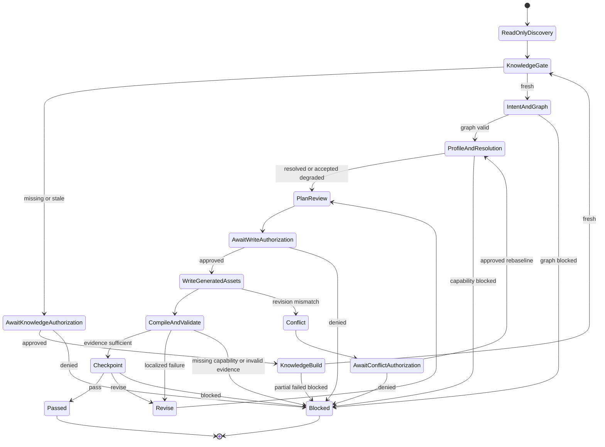

# Shader Skill 调用 Unity MCP 的安全执行协议

## 1. 目的

本文定义 [`shader-authoring-agent`](shader-authoring-agent/SKILL.md) 与 [`shader-knowledge-base-builder`](shader-knowledge-base-builder/SKILL.md) 调用 Unity MCP 的授权、权限、状态转换、失败处理、工件存档与回收规则。

该协议建立在 [`unity-mcp-p0-p1-contract.md`](unity-mcp-p0-p1-contract.md) 的 MCP 工具契约与 [`shader-authoring-data-contract.md`](shader-authoring-data-contract.md) 的对象交接契约之上。

原则：

```text
先形成可审查对象
  -> 再取得阶段授权
  -> 再执行最小权限 MCP 操作
  -> 再持久化可验证证据
  -> 再决定继续 修正 或阻断
```

## 2. 权限模型

### 2.1 执行主体

```text
Principal
  user
  shader-authoring-agent
  shader-knowledge-base-builder
  unity-mcp
```

- `user` 是唯一可以批准新的副作用范围、扩展范围、冲突处理与恢复动作的主体。
- `shader-authoring-agent` 仅负责材质任务对象、计划、生成资产写入和验证编排。
- `shader-knowledge-base-builder` 仅负责只读工程分析与知识库工件发布。
- `unity-mcp` 仅按结构化工具参数、路径规则、revision 前置条件和有效授权执行，不能自行扩大范围。

### 2.2 权限能力

```text
Capability
  READ_PROJECT_STATE
  READ_KNOWLEDGE_BASE
  BUILD_KNOWLEDGE_BASE
  WRITE_GENERATED_ASSET
  COMPILE_GENERATED_ASSET
  CONFIGURE_ISOLATED_VALIDATION
  CAPTURE_VALIDATION_EVIDENCE
  CREATE_CHECKPOINT
  RESTORE_GENERATED_ASSET
```

能力映射：

| 能力 | 允许主体 | 写入范围 | 用户阶段授权 |
|---|---|---|---|
| `READ_PROJECT_STATE` | 两个 Skill | 无 | 不需要 |
| `READ_KNOWLEDGE_BASE` | 主 Skill | 无 | 不需要 |
| `BUILD_KNOWLEDGE_BASE` | Builder Skill | [`Artifacts/ShaderKnowledgeBase/`](../Artifacts/ShaderKnowledgeBase/) | 必须 |
| `WRITE_GENERATED_ASSET` | 主 Skill | [`Assets/AIShader/Generated/`](../Assets/AIShader/Generated/) | 每个新 Code Plan 的首次写入必须 |
| `COMPILE_GENERATED_ASSET` | 主 Skill | 无，产生运行工件 | 已批准 Plan 内自动 |
| `CONFIGURE_ISOLATED_VALIDATION` | 主 Skill | [`Artifacts/ShaderRuns/`](../Artifacts/ShaderRuns/) | 已批准 Plan 内自动 |
| `CAPTURE_VALIDATION_EVIDENCE` | 主 Skill | [`Artifacts/ShaderRuns/`](../Artifacts/ShaderRuns/) | 已批准 Plan 内自动 |
| `CREATE_CHECKPOINT` | 主 Skill | [`Artifacts/ShaderRuns/`](../Artifacts/ShaderRuns/) | 已批准 Plan 内自动 |
| `RESTORE_GENERATED_ASSET` | 主 Skill | [`Assets/AIShader/Generated/`](../Assets/AIShader/Generated/) | 必须 |

任何未列能力均默认拒绝。特别是修改 `Packages/`、`ProjectSettings/`、现有业务场景、非 Generated 的 `Assets/AIShader/`、RP Asset、Renderer Data、质量设置或用户材质均不属于首期协议。

## 3. 阶段授权

### 3.1 授权类型

```text
AuthorizationGrant
  grantId: string
  trace: TraceContext
  type: knowledge_base_build | code_plan_first_write | scope_expansion | conflict_resolution | checkpoint_restore
  status: proposed | approved | denied | expired | consumed
  requestedBy: shader-authoring-agent | shader-knowledge-base-builder
  userDecisionEvidence: string
  scope: AuthorizationScope
  issuedAtUtc: ISO-8601
  expiresAtUtc: ISO-8601 | null

AuthorizationScope
  runId: string
  knowledgeBaseVersion: string | null
  codePlanId: string | null
  allowedCapabilities: Capability[]
  allowedFiles: string[]
  allowedAssetRevisions: AssetRevisionRef[]
  allowedJobTypes: string[]
  maxWrites: integer
```

`AuthorizationGrant` 必须作为 [`operationContext`](unity-mcp-p0-p1-contract.md) 的 `authorizationGrantId` 附加字段传递给所有有副作用的 MCP 调用。

### 3.2 授权矩阵

| 触发点 | 必须给用户展示的内容 | 授权范围 | 是否自动继续 |
|---|---|---|---|
| 知识库不存在或失效 | 构建模式、失效原因、仅读工程范围、知识库工件目录 | 一个 `full` 或 `incremental` 构建 Job | 否 |
| 新 Code Plan 的第一次生成资产写入 | 假设、目标文件、基线 revision、将创建或修改的生成资产、验证计划、回滚边界 | 该 `codePlanId` 中的首批写入 | 否 |
| 同一 Plan 内编译、验证、截图、Checkpoint | 不另行展示 | 仅已批准 Plan 的非写入副作用 | 是 |
| 计划新增文件、修改未批准文件、增加效果或渲染状态 | 变化原因、扩展文件和新风险 | 扩展后的最小范围 | 否 |
| revision 冲突 | 当前版本、计划基线、差异摘要、可选处理策略 | 仅选定冲突处理路径 | 否 |
| 恢复 Checkpoint | 将恢复的生成文件、当前 revision、Checkpoint revision、不可恢复项 | 单次恢复 | 否 |

### 3.3 授权有效性

授权仅在以下全部条件成立时有效：

1. `runId` 与当前请求一致。
2. `codePlanId` 和 `knowledgeBaseVersion` 与授权范围一致。
3. 请求工具、Job 类型、目标路径和能力均在 `AuthorizationScope` 内。
4. 目标资产 revision 与 `allowedAssetRevisions` 一致；新建资产必须显式为 `absent`。
5. 授权未过期、未被拒绝、未超出 `maxWrites`。
6. 没有发生影响该 Plan 的环境、Pipeline、Renderer、知识库或锚点失效。

任一条件不满足时，Unity MCP 返回 `permission_denied` 或 `conflict`，Skill 必须停止并回到 Profile 或授权阶段，不能自动扩大授权。

## 4. 正常执行状态机



### 4.1 只读发现阶段

允许：

```text
get_editor_state
get_shader_knowledge_base_status
query_shader_knowledge_base
get_asset_revision
inspect_shader_structure
get_logs
```

禁止：任何写入、导入、场景配置、截图、创建 Checkpoint 或任意 C#。

输出是可审计的 `MaterialIntent`、`EffectOrderDecision`、`RenderingSemanticGraph`、`ProjectShaderProfile` 与 `ResolvedSemanticGraph`。没有这些对象，不得进入 Plan 或申请写入授权。

### 4.2 知识库阶段

仅 Builder Skill 可申请 `knowledge_base_build` 授权。授权获得后，调用 [`build_shader_knowledge_base`](unity-mcp-p0-p1-contract.md) 或等价 Job。

硬约束：

- 构建 Job 只可读取项目和写入 [`Artifacts/ShaderKnowledgeBase/`](../Artifacts/ShaderKnowledgeBase/)。
- 仅成功 `fresh` 结果可原子更新 `current.json`。
- `partial`、`failed`、`blocked` 必须产生报告，但不能进入生成链路。
- 同一个确定性构建参数必须使用 `idempotencyKey`，避免重复扫描和版本竞争。

### 4.3 写入与验证阶段

主 Skill 先生成 `ShaderCodePlan`，展示给用户并申请 `code_plan_first_write`。

批准后，执行顺序固定：

```text
1. get_asset_revision
2. 写入前重新检查 codePlan.allowedFiles、baseRevision 与授权范围
3. write_generated_text_asset
4. refresh_and_compile_assets
5. ensure_validation_scene
6. capture_validation
7. create_shader_checkpoint
```

- 第 1 步发现 revision 已变，进入冲突状态，不能写入。
- 第 3 步仅可写 `ShaderCodePlan.plannedChanges` 中的单个资产；每次写入生成 diff 工件。
- 第 4 至 7 步属于已批准 Plan 的验证链，可自动执行，但每个 Job 仍须携带相同 `runId`、`codePlanId` 和 `authorizationGrantId`。
- 编译失败时不得执行截图判定；可以创建 `REVISE` 或 `BLOCKED` Checkpoint 保存诊断。

## 5. 范围扩大与冲突处理

### 5.1 范围扩大

下列任一情况必须停止自动执行、创建新的 `ShaderCodePlan` 并申请 `scope_expansion`：

- 新增或移除 `allowedFiles`；
- 新增效果层、改变默认或用户确认的效果顺序；
- 改变透明、裁剪、Blend、ZWrite、Render Queue；
- 修改当前迭代假设以外的语义节点；
- 需要新贴图、材质或验证资产；
- 需要更新或引用另一份知识库版本；
- 发现额外 Include、Pass、Keyword 或项目能力依赖。

范围扩大不得以“同一 Shader 文件”作为豁免理由。若变化涉及新的语义节点或渲染状态，即使文件未变，也视为扩大。

### 5.2 Revision 冲突

冲突处理流程：

```text
revision conflict
  -> 停止所有写入和后续验证
  -> 获取当前 revision 与差异工件
  -> 标记当前 Code Plan 为 stale
  -> 向用户展示：重新基线 / 放弃当前 Plan / 创建新生成资产
  -> 用户批准后才重新检索锚点并创建新 Plan
```

禁止：

- 自动重试覆盖；
- 用旧 Anchor 写新 revision；
- 在没有新授权的情况下将目标切换到其他文件；
- 把用户当前改动拷贝到生成资产以规避冲突。

## 6. 工件目录与生命周期

### 6.1 目录布局

```text
Artifacts/
  ShaderKnowledgeBase/
    current.json
    versions/
      <knowledge-base-version>/
        manifest.json
        coverage-report.json
        evidence/

  ShaderRuns/
    <runId>/
      manifest.json
      requirement.json
      classification.json
      material-intent.json
      effect-order-decision.json
      semantic-graph.json
      knowledge-retrieval.json
      project-shader-profile.json
      resolved-semantic-graph.json
      code-plans/
        <codePlanId>.json
      operations/
        <operationId>-request.json
        <operationId>-response.json
      revisions/
        <asset-path-safe>-before.txt
        <asset-path-safe>-after.txt
        <operationId>.diff
      validation/
        <validationSessionId>/
          session-manifest.json
          captures/
            <captureId>.png
            <captureId>.manifest.json
          scans/
            <scanId>.json
      checkpoints/
        <checkpointId>.json
      reports/
        decision-<iterationId>.json
        blocked-<iterationId>.json
```

生成资产仅位于：

```text
Assets/AIShader/Generated/
```

绝不在 `Artifacts/` 内生成可被业务引用的 Shader；绝不在 `Assets/AIShader/Generated/` 内保存知识库、截图或运行日志。

### 6.2 不可变性与发布

- 每个 `runId` 目录创建后不可跨运行复用。
- 每个 Code Plan、操作请求/响应、验证 Manifest、决策报告和 Checkpoint 都以 append-only 方式创建。
- `current.json` 是唯一可变知识库指针，但仅能通过 `fresh` 知识库的原子发布更新。
- 一个 `PASS` Checkpoint 不覆盖之前的 `REVISE` 或失败证据。
- 文本资产的 before/after 快照、diff 和实际 revision 必须共同保存；不得仅保存生成代码文本。

### 6.3 保留与清理

首期默认策略：不自动删除工件。

可在后续版本加入受用户批准的清理 Job，但必须满足：

- 不删除任何仍被 `current.json`、活跃 Run、Checkpoint 或生成资产引用的工件；
- 清理前生成删除清单和大小摘要；
- 清理仅影响 [`Artifacts/`](../Artifacts/)；
- 删除不影响 Unity 项目编译和业务资产；
- 清理操作需要独立阶段授权。

## 7. 失败与恢复规则

| 情况 | 当前动作 | 允许后续动作 | 禁止动作 |
|---|---|---|---|
| MCP 未连接 | `BLOCKED`，保存连接诊断 | 重连后从只读检查恢复 | 假设 Editor 状态继续写入 |
| 知识库非 fresh | 停止主链路 | 请求构建或刷新授权 | 用 stale 或 partial 知识库生成 |
| 图或排序阻塞 | `BLOCKED` | 补充用户语义或排序确认 | 猜测顺序或删除效果 |
| revision 冲突 | `CONFLICT` | 用户批准后重建 Profile 和 Plan | 覆盖或自动合并 |
| 编译失败 | `REVISE`，保存诊断 | 只修正当前假设并重新授权写入 | 做视觉截图判定 |
| 验证不足 | `BLOCKED` 或 `REVISE` | 补充当前 Plan 内允许的证据 | 以主观截图替代缺失检查 |
| 截图 Job 失败 | `REVISE` 或 `BLOCKED` | 修复验证环境后重试 | 使用旧 run 截图作为本轮证据 |
| Checkpoint 写入失败 | `BLOCKED` | 修复工件写入后重试 | 宣布 PASS 或丢弃诊断 |
| 恢复请求 | 等待 `checkpoint_restore` 授权 | revision 匹配后恢复生成资产 | 恢复非 Generated 文件或强制覆盖 |

## 8. `execute_editor_command` 的例外政策

当前 [`execute_editor_command`](../Tools/unity-mcp-server/src/index.ts) 是完全信任的任意 C# 通道。首期正常链路不得依赖它。

允许使用的例外：

- 人工批准的只读诊断，且结构化工具缺少等价查询；
- MCP 或 Unity Job Host 的故障排查；
- 在隔离测试工程中验证未来 MCP 工具实现的原型。

例外请求必须额外记录：

```text
DiagnosticEscapeHatchRecord
  trace: TraceContext
  userApprovalEvidence: string
  reasonStructuredToolUnavailable: string
  codeHash: string
  declaredReadSet: string[]
  declaredWriteSet: string[]
  resultArtifact: ArtifactRef
```

- `declaredWriteSet` 在生产项目中必须为空。
- 任意 C# 结果不能直接构成写入授权、编译通过或验收通过的唯一证据。
- 一旦结构化工具实现，等价逃生操作必须迁移并禁止继续作为常规路径。

## 9. 协议验收标准

1. 每个产生副作用的 MCP 请求都能追溯到一个有效 `AuthorizationGrant`、`runId`、`codePlanId` 或知识库构建上下文。
2. 首次写入、范围扩大、冲突处理、知识库构建和 Checkpoint 恢复均无用户授权不可执行。
3. 已批准 Code Plan 内的编译、验证、截图和 Checkpoint 无需重复打断用户。
4. MCP 无法写入 [`Assets/AIShader/Generated/`](../Assets/AIShader/Generated/)、[`Artifacts/ShaderKnowledgeBase/`](../Artifacts/ShaderKnowledgeBase/) 与 [`Artifacts/ShaderRuns/`](../Artifacts/ShaderRuns/) 之外的路径。
5. 所有 `PASS` 都存在对应 Checkpoint、编译证据、Console 增量证据、验证会话 Manifest 与精确资产 revision。
6. 冲突、失败、阻断和取消均保留工件，不会覆盖用户资产，也不会伪造成功状态。
7. 常规 Skill 流程不调用任意 C# 工具；例外使用具有独立用户批准与审计记录。
