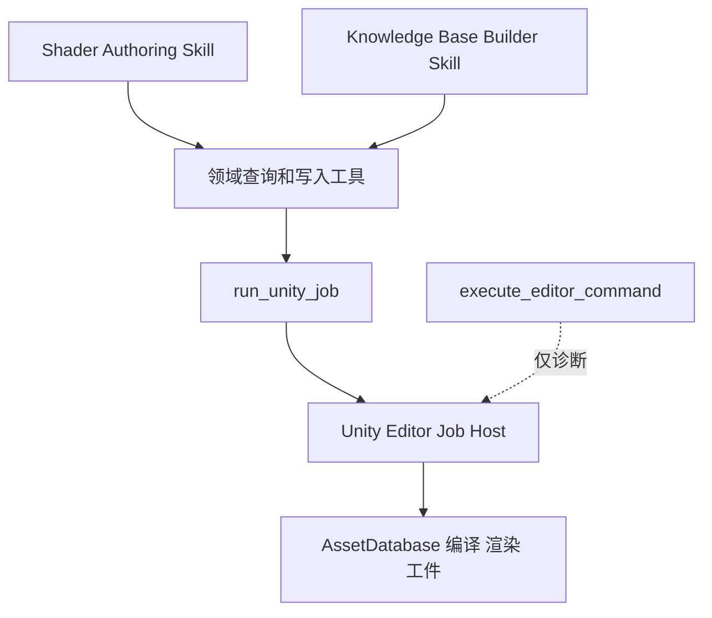

# Unity MCP P0/P1 工具契约

## 1. 目标与范围

本文定义 Shader Authoring Skill 与 Shader Knowledge Base Builder Skill 使用的结构化 Unity MCP 工具契约。

目标是替代常规流水线中对任意 C# 的依赖，支持以下闭环：

```text
知识库门禁
  -> 知识库构建或查询
  -> Shader 结构与实时锚点核验
  -> 受修订保护的生成资产写入
  -> 刷新与编译
  -> 确定性验证与截图
  -> Checkpoint 和证据存档
```

首期不删除 `execute_editor_command`。该工具仅用于人工批准的诊断、原型验证与维护逃生，不得作为两个 Skill 的标准生成路径。

## 2. 工具分层



- 查询型工具：短时、只读、同步返回结构化结果。
- 写入、扫描、刷新、编译、渲染、截图型工具：统一通过异步 Job 执行。
- 所有 Job 产生可追溯工件，调用方不得以 Console 文本代替正式结果。

## 3. 全局协议

### 3.1 统一结果信封

每个 MCP 工具都返回下列结构。`ok = false` 代表工具层失败；业务无法完成但正常返回时使用 `status` 表达。

```text
ToolResult<T>
  ok: boolean
  requestId: string
  serverTimeUtc: ISO-8601
  data: T
  warnings: Warning[]
  error: ToolError | null

Warning
  code: string
  message: string
  evidenceRefs: EvidenceRef[]

ToolError
  code: invalid_argument | permission_denied | conflict | unavailable | timeout | internal
  message: string
  retryable: boolean
  details: object

EvidenceRef
  kind: asset | artifact | log_cursor | unity_object | source_location
  id: string
  path: project-relative path | null
  revision: string | null
```

### 3.2 路径和根目录

路径一律为 Unity 项目根目录相对路径，使用 `/` 分隔符；拒绝绝对路径、`..`、盘符、符号链接逃逸与项目外文件。

```text
只读根目录
  Assets/
  Packages/
  ProjectSettings/
  Artifacts/

结构化工具可写根目录
  Assets/AIShader/Generated/
  Artifacts/ShaderKnowledgeBase/
  Artifacts/ShaderRuns/
```

- 写入操作必须校验目标路径位于可写根目录。
- 对 `Packages/`、`ProjectSettings/`、既有 `Assets/AIShader/` 非 Generated 内容一律拒绝写入。
- 知识库构建只能写 `Artifacts/ShaderKnowledgeBase/`。
- 验证证据、运行报告和 Checkpoint 只能写 `Artifacts/ShaderRuns/`。
- Shader 与材质生成资产只能写 `Assets/AIShader/Generated/`。

### 3.3 身份、关联和审计字段

会改变状态的请求必须携带：

```text
operationContext
  runId: string
  skill: shader-authoring-agent | shader-knowledge-base-builder
  operation: enum
  requestedBy: user-approved | skill-continuation
  knowledgeBaseVersion: string | null
  codePlanId: string | null
  checkpointId: string | null
```

服务端将此上下文写入 Job 元数据和工件 Manifest。`requestedBy = skill-continuation` 只允许在同一 `runId` 已得到用户批准的操作范围内继续。

### 3.4 修订与并发规则

- 每个文本资产、Unity 资产和知识库版本均有稳定 `revision`。
- 写入必须带 `baseRevision`；新资产可使用 `baseRevision = absent`。
- 服务端发现当前 revision 不一致时返回 `conflict`，不得覆盖。
- 一次 Job 产生的写入清单必须在开始前冻结。计划外路径即使在可写根目录也必须拒绝。

### 3.5 Job 通用状态

```text
JobStatus
  queued
  running
  waiting_for_unity
  succeeded
  failed
  cancelled
  blocked

JobResult
  jobId
  status: JobStatus
  phase: string
  progress: 0..1 | null
  startedAtUtc
  completedAtUtc | null
  result: object | null
  warnings: Warning[]
  error: ToolError | null
  artifacts: ArtifactRef[]
  logCursor: string | null

ArtifactRef
  artifactId: string
  type: manifest | json | image | text | checkpoint | diff | report
  path: project-relative path
  contentHash: string
```

`run_unity_job` 只负责入队；超过短暂排队窗口时也必须返回 `jobId`，不能因 Node 端固定 5 秒等待而判定任务失败。

## 4. P0：统一异步任务协议

### 4.1 `run_unity_job`

启动白名单中的具名任务。它不接受 C# 源码、反射表达式、任意文件路径列表或任意 Unity API 调用。

```text
Request
  jobType: JobType
  args: object
  operationContext
  idempotencyKey: string
  dryRun: boolean = false

Response.data
  jobId: string
  status: queued | running | succeeded
  acceptedJobType: JobType
  acceptedAtUtc: ISO-8601
  logCursor: string
  normalizedArgs: object
```

允许的 `JobType`：

```text
build_shader_knowledge_base
refresh_and_compile_assets
ensure_validation_scene
capture_validation
create_shader_checkpoint
restore_shader_checkpoint
```

首期不以 Job 形式暴露通用资产写入；写入由第 6 节的 `write_generated_text_asset` 完成，编译、验证和 Checkpoint 使用 Job。

约束：

- `idempotencyKey` 在相同 `runId + jobType + normalizedArgs` 内重复调用必须返回原 Job 或等价结果。
- `dryRun = true` 不得写入、不创建 Unity 场景对象、不触发导入；只返回将访问的资产、将写入的工件、权限检查结果和预期阶段。
- 任一 Job 必须声明读写集合、预期工件类型和取消策略。

### 4.2 `get_unity_job`

```text
Request
  jobId: string
  include: status | progress | result | artifacts | logs
  waitMs: 0..30000 = 0

Response.data
  JobResult
```

`waitMs` 只允许长轮询已有 Job 状态，不创建新工作；上限 30 秒，调用方可轮询。

### 4.3 `cancel_unity_job`

```text
Request
  jobId: string
  reason: string
  operationContext

Response.data
  jobId
  previousStatus
  status: cancelled | cancellation_requested | not_cancellable | already_terminal
  preservedArtifacts: ArtifactRef[]
```

- 正在写入原子发布阶段的知识库 Job 不可取消，返回 `not_cancellable`。
- 取消不得删除已产生的诊断工件；必须保留部分结果并明确其不可作为 `fresh` 知识库或 `PASS` 证据。

## 5. P1：知识库工具

### 5.1 `get_shader_knowledge_base_status`

供主 Skill 执行门禁判断。只读、同步。

```text
Request
  expectedSchemaVersion: string
  freshnessPolicy: strict | allow_stale_for_review = strict
  include: manifest | coverage | invalidation | partitions

Response.data
  exists: boolean
  status: missing | fresh | stale | building | partial | failed | incompatible
  knowledgeBaseVersion: string | null
  schemaVersion: string | null
  manifestPath: string | null
  fingerprintComparison
    project: string
    manifest: string | null
    matches: boolean
    changedDomains: environment | pipeline | packages | shader_corpus | library | conventions
  coverageSummary
  invalidationReasons: string[]
  lastBuild
    jobId: string | null
    completedAtUtc: ISO-8601 | null
    result: fresh | partial | failed | null
  evidenceRefs: EvidenceRef[]
```

门禁规则：仅当 `status = fresh`、Schema 匹配、`fingerprintComparison.matches = true` 时，主 Skill 才可进入需求解析后的生成流程。

### 5.2 `build_shader_knowledge_base`

此工具是 `run_unity_job(jobType = build_shader_knowledge_base)` 的领域包装。为减少 Skill 误配，推荐对外保留该具名工具，内部仍走统一 Job Host。

```text
Request
  mode: full | incremental
  reason: missing | user_requested | fingerprint_changed | schema_changed | task_discovery
  operationContext
  expectedBaseVersion: string | absent
  partitions: environment | library | shader_corpus | conventions | capabilities | retrieval
  publishPolicy: publish_fresh_only = publish_fresh_only
  idempotencyKey: string
  dryRun: boolean = false

Response.data
  jobId: string
  status: queued | running | succeeded
  plannedPartitions
  existingVersion: string | null
  targetArtifactRoot: Artifacts/ShaderKnowledgeBase/
  logCursor: string
```

构建完成后，`get_unity_job` 的 `result` 必须符合：

```text
KnowledgeBaseBuildResult
  status: fresh | partial | failed | blocked
  knowledgeBaseVersion: string | null
  buildMode: full | incremental
  manifestPath: string | null
  refreshedPartitions: string[]
  coverageReport: ArtifactRef
  unresolvedItems: string[]
  evidenceSummary: EvidenceRef[]
  failureReason: string | null
  recommendedNextAction: string
```

发布约束：

- 仅 `status = fresh` 可原子更新 `Artifacts/ShaderKnowledgeBase/current.json`。
- `partial`、`failed`、`blocked` 必须保留报告，但绝不可改变 `current.json`。
- Builder Skill 的只读约束不因该工具而改变：该 Job 只能写知识库工件，不能修改 Shader、材质、场景、RP Asset 或项目设置。

### 5.3 `query_shader_knowledge_base`

将 MaterialIntent 或 RenderingSemanticGraph 的特征映射为可追溯工程证据；它不对资产当前状态做实时保证。

```text
Request
  knowledgeBaseVersion: string
  query
    semanticFeatures: string[]
    requiredCapabilities: string[]
    renderModes: opaque | alpha_clip | alpha_blend
    effectKinds: dissolve | pulse_emission | fresnel_rim
    targetPipeline: builtin | urp | hdrp | custom_srp | unknown
  limits
    examples: 1..10 = 5
    functionCards: 1..20 = 10
    conventions: 1..20 = 10
  minimumConfidence: low | medium | high = low

Response.data
  knowledgeBaseVersion
  retrievalStatus: complete | limited | absent | incompatible
  matchedShaderExamples: ShaderExampleRef[]
  matchedFunctionCards: FunctionCardRef[]
  matchedConventions: ConventionRef[]
  capabilityEvidence: CapabilityEvidence[]
  missingCoverage: string[]
  evidenceRefs: EvidenceRef[]
```

每个命中项必须含 `path`、`sourceRevision`、`sourceLocation`、`confidence` 和 `whyMatched`。调用方随后必须用实时检查工具验证仍然存在。

## 6. P1：工程锚点、资产修订与受限写入

### 6.1 `inspect_shader_structure`

用于构建任务级 `ProjectShaderProfile`。只读、同步；可检查现有项目 Shader，也可检查生成目录内资产。

```text
Request
  assetPath: string
  expectedRevision: string | null
  include
    properties: boolean = true
    passes: boolean = true
    programEntries: boolean = true
    structures: boolean = true
    includes: boolean = true
    keywords: boolean = true
    renderStates: boolean = true
    sourceLocations: boolean = true

Response.data
  asset
    path
    revision
    exists
    shaderName
  properties: PropertyAnchor[]
  passes: PassAnchor[]
  programEntries: ProgramEntryAnchor[]
  structures: StructureAnchor[]
  includes: IncludeAnchor[]
  keywords: KeywordAnchor[]
  renderStates: RenderStateAnchor[]
  parseDiagnostics: Diagnostic[]
  evidenceRefs: EvidenceRef[]
```

若 `expectedRevision` 不匹配，仍返回当前结构，但在 `warnings` 标记 `revision_changed`；Skill 必须重新评估其 Code Plan，不能沿用旧锚点写入。

### 6.2 `get_asset_revision`

```text
Request
  assetPaths: string[]
  includeContentHash: boolean = true
  includeMetaRevision: boolean = false

Response.data
  assets
    path
    exists
    kind: text | unity_asset | directory | unknown
    revision: string | absent
    contentHash: string | null
    lastWriteUtc: ISO-8601 | null
    writableByStructuredTool: boolean
```

`revision` 是服务端定义的稳定值，至少由内容哈希和相关 meta/import 信息生成；调用方不可自行猜测。

### 6.3 `write_generated_text_asset`

仅用于创建或更新生成目录内的 `.shader`、`.hlsl`、`.cginc`、`.json`、`.md` 等文本工件。材质 `.mat` 必须由后续专用材质工具或 Validation Job 创建，不能直接写 YAML。

```text
Request
  asset
    path: string
    kind: shader | hlsl | cginc | json | markdown | text
    contentUtf8: string
    baseRevision: string | absent
    createPolicy: create_only | update_only | create_or_update
  codePlan
    codePlanId: string
    allowedFiles: string[]
    targetAnchors: string[]
    semanticNodes: string[]
  operationContext
  writeReason: string

Response.data
  asset
    path
    previousRevision: string | absent
    newRevision: string
    contentHash: string
  changedRanges: SourceRange[]
  importRequired: boolean
  artifactDiff: ArtifactRef
```

强制规则：

- `asset.path` 必须同时位于可写根目录和 `codePlan.allowedFiles`。
- `baseRevision` 不匹配返回 `conflict`。
- `update_only` 遇到不存在资产返回 `invalid_argument`；`create_only` 遇到已有资产返回 `conflict`。
- 若 `targetAnchors` 不是新建资产，服务端需验证所有锚点仍存在；缺失返回 `conflict` 或 `blocked`。
- 不提供任意 patch 语言、正则替换或跨文件写操作；每调用只写一个资产。

## 7. P1：编译、验证和 Checkpoint

### 7.1 `refresh_and_compile_assets`

此工具启动 Job，用于资产刷新、导入完成等待和 Shader 编译诊断归集。

```text
Request
  assetPaths: string[]
  expectedRevisions
    path: string
    revision: string
  operationContext
  compileScope: specified_assets | dependencies
  failOnWarning: boolean = false
  idempotencyKey: string

Response.data
  jobId
  status: queued | running | succeeded
  logCursor
```

终态结果：

```text
CompileResult
  status: passed | failed | blocked
  compiledAssets
    path
    requestedRevision
    observedRevision
    importStatus
  diagnostics: Diagnostic[]
  newlyObservedLogs: LogEntryRef[]
  dependencyChanges: AssetRevisionRef[]
  evidenceRefs: EvidenceRef[]
```

仅当所有请求资产的 `observedRevision` 等于写入返回的 `newRevision`，且无 Error 或 Exception 级诊断时才允许 `passed`。

### 7.2 `ensure_validation_scene`

创建或复用生成目录外不可变基线的验证场景配置。场景资产本身可由该 Job 写入 `Artifacts/ShaderRuns/<runId>/` 的序列化配置；若需要 Unity `.unity` 场景，仅允许由预置验证场景模板实例化，不得修改用户业务场景。

```text
Request
  operationContext
  validationProfile
    profileId: pbr_sphere_baseline
    cameraPreset: string
    lightingPreset: string
    environmentPreset: string
    targetGeometry: sphere
    debugChannels: string[]
  target
    shaderPath: string
    shaderRevision: string
    materialProperties: object
  reusePolicy: reuse_matching | recreate
  idempotencyKey: string

Response.data
  jobId
  status: queued | running | succeeded
  validationSessionId
  logCursor
```

终态结果必须产出配置 Manifest，包含 Unity 版本、Pipeline、相机、灯光、环境、几何、材质属性、Shader revision 和所有随机种子。

### 7.3 `capture_validation`

```text
Request
  operationContext
  validationSessionId: string
  captures
    captureId: string
    channel: beauty | albedo | normal | metallic | roughness | emission | alpha | clip_mask
    cameraPreset: string
    background: transparent | checker | environment
    resolution
      width: integer
      height: integer
  outputPolicy: fail_if_exists | versioned
  idempotencyKey: string

Response.data
  jobId
  status: queued | running | succeeded
  logCursor
```

终态结果：

```text
ValidationCaptureResult
  status: passed | failed | blocked
  validationSessionId
  captures
    captureId
    channel
    image: ArtifactRef
    manifest: ArtifactRef
    imageHash: string
  diagnostics: Diagnostic[]
  evidenceRefs: EvidenceRef[]
```

截图必须写入 `Artifacts/ShaderRuns/<runId>/captures/`，且每张图都有同名或关联 Manifest；截图不代表自动视觉验收通过，只是证据输入。

### 7.4 `create_shader_checkpoint`

保存一个不可变 Checkpoint，作为 `PASS`、`REVISE`、`BLOCKED` 的证据根。

```text
Request
  operationContext
  decision: pass | revise | blocked
  summary: string
  assetRevisions
    path
    revision
  knowledgeBaseVersion: string
  codePlanRef: ArtifactRef | null
  validationRefs: ArtifactRef[]
  diagnosticsRefs: EvidenceRef[]
  rollback
    strategy: restore_generated_assets | no_mutation
    eligible: boolean

Response.data
  jobId
  status: queued | running | succeeded
  checkpointId
  artifactRoot: Artifacts/ShaderRuns/<runId>/checkpoints/
```

终态结果：

```text
CheckpointResult
  checkpointId
  decision: pass | revise | blocked
  manifest: ArtifactRef
  trackedAssets: AssetRevisionRef[]
  recoverable: boolean
  restoreConstraints: string[]
```

`restore_shader_checkpoint` 仅能恢复该 Checkpoint 记录的生成目录文本资产，且恢复前仍必须校验当前 revision；若用户或外部工具已修改，返回 `conflict`，绝不强制覆盖。

## 8. 现有工具迁移规则

| 现有工具 | 保留用途 | 不再承担的标准链路职责 |
|---|---|---|
| `get_editor_state` | 连接诊断、场景和选择概览 | 知识库环境事实、Shader 结构解析、编译判定 |
| `get_logs` | 临时诊断和补充查询 | 一次运行的正式编译和验证结果 |
| `execute_editor_command` | 人工批准的只读诊断、原型调试、维护逃生 | 知识库构建、常规写入、编译等待、截图、Checkpoint |

## 9. P0/P1 验收标准

1. 所有长任务均能在 Node 等待超时后继续执行，并可通过 `get_unity_job` 查询终态。
2. 任意结构化写入均无法逃出三个可写根目录。
3. 任意写入均需 `operationContext`、`codePlanId` 和 `baseRevision`，且 revision 冲突不会覆盖资产。
4. `build_shader_knowledge_base` 在 `partial`、`failed`、`blocked` 时不更新 `current.json`。
5. 主 Skill 可仅用 `get_shader_knowledge_base_status` 完成门禁判定。
6. Shader Authoring Skill 可获得结构化的 Shader 锚点、编译诊断、验证截图和 Checkpoint Manifest，而无需解析任意 C# 的自由文本输出。
7. `execute_editor_command` 的权限说明明确为人工诊断用途，Skill 正常执行路径不依赖该工具。
